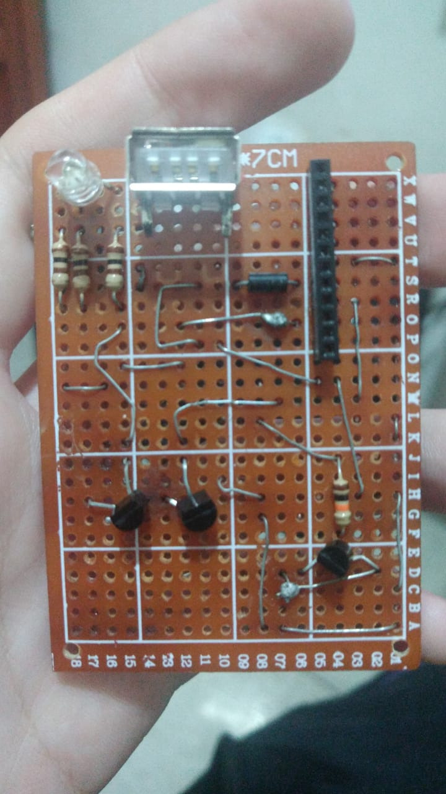
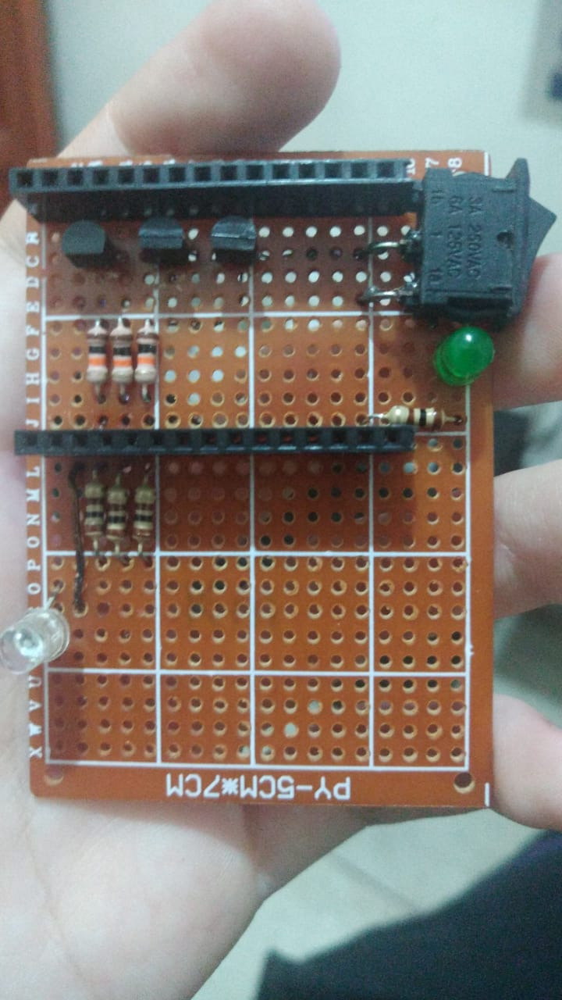

# 🔥 ardOS - Arduino Operating System


> 🎯 **A lightweight, feature-rich operating system for Arduino and ESP32 microcontrollers**

ardOS is a minimalist operating system designed for Arduino Uno (ATmega328P) and ESP32 (Xtensa LX6), featuring a serial terminal interface, cooperative multitasking, and built-in applications like a Snake game and LED control. Optimized for low memory usage, it provides a robust platform for embedded systems development.

## ✨ Features

- 🖥️ **Serial Terminal Interface** - Interactive command-line interface via UART
- 🎮 **Built-in Games** - Snake game with WASD controls
- 💡 **LED Control** - Blink command with task management
- 🧠 **Memory Optimized** - Custom string functions for minimal RAM usage
- ⚡ **Cooperative Multitasking** - Simple task switching system
- 🔄 **Real-time Processing** - Non-blocking serial communicationControl
- 🎨 **ANSI Terminal Support** - Clear screen and cursor positioning

> 🔨 Coming soon!
> Wifi, Bluetooth, "Video"

## 🔩 Shield Fatures

- 💡 **LED Color Codes** - Blinks a led with color codes

> 🔨 Coming soon!
> USB Support

## 🚀 Quick Start

### Prerequisites

#### For Arduino Uno (ATmega328P)
- Arduino Uno (or compatible ATmega328P board)
- AVR-GCC toolchain (`avr-gcc`, `avr-objcopy`, `avrdude`)
- USB-B cable

#### For ESP32 (Xtensa LX6)
- ESP32 development board (e.g., ESP32-WROOM-32, DevKitC)
- ESP-IDF toolchain (configured in `~/.espressif/esp-idf`)
- Micro USB cable
- Node.js (for helper scripts)

#### For x86 (Testing/Emulation)
- // Future Complex Kernel with video drivers and some things who are not accepted by Arduino and Esp32


- GCC toolchain (`gcc`, `ld`, `objcopy`)
- NASM assembler (`nasm`)
- QEMU emulator (`qemu-system-i386`)

### Installation & Build

1. **Clone the repository**

   ```bash
   git clone https://github.com/lucasFelixSilveira/ardOS.git
   cd ardOS
   ```

2. **Configure your build environment**

   - Ensure the required toolchains are installed:
     - **ATmega328P**: `sudo apt-get install gcc-avr binutils-avr avr-libc avrdude` (Ubuntu/Debian)
     - **ESP32**: Follow ESP-IDF setup at [https://docs.espressif.com/projects/esp-idf/en/latest/esp32/get-started/](https://docs.espressif.com/projects/esp-idf/en/latest/esp32/get-started/)
     - **x86**: `sudo apt-get install gcc nasm binutils qemu-system-x86` (Ubuntu/Debian)
   - Set the ESP-IDF path if not default:
     ```bash
     export ESP_IDF_PATH=~/.espressif/esp-idf
     ```
     Alternatively, update `build.sh` with your ESP-IDF path (default: `/home/user/.espressif/esp-idf`).

3. **Build and upload**

   Use the provided `build.sh` script to build and upload for your target platform:

   ```bash
   chmod +x build.sh
   ./build.sh {atmega|xtensa|x86|all} [debug]
   ```

   - **Options**:
     - `atmega`: Build and upload for Arduino Uno (ATmega328P)
     - `xtensa`: Build and upload for ESP32
     - `x86`: Build for x86 (emulation in QEMU)
     - `all`: Build for all platforms
     - `debug`: Enable debug mode (optional, append after platform)
     - `clean`: Clean the build directory
     - `list`: List source files and kernel size limits

   **Example**:
   ```bash
   ./build.sh atmega       # Build and upload for Arduino Uno
   ./build.sh xtensa debug # Build and upload for ESP32 with debug mode
   ./build.sh clean        # Clean build directory
   ```

4. **Test the build**

   - **ATmega328P**:
     ```bash
     avrdude -c arduino -p m328p -P /dev/ttyUSB0 -b 115200 -U flash:w:build/main_atmega.hex:i
     ```
   - **ESP32**:
     ```bash
     idf.py -p /dev/ttyUSB0 flash monitor
     ```
   - **x86**:
     ```bash
     qemu-system-i386 -drive format=raw,file=build/ardOS_32.img -serial stdio
     ```

## 🎮 Usage

### Serial Terminal
Connect to your Arduino (9600 baud) or ESP32 (115200 baud) via a serial monitor (e.g., PuTTy) and start typing commands:

```
current@user % blink
current@super % running blink...
Starts blinking! - Type kill to finish.
```

### Available Commands

| Command | Description | Usage |
|---------|-------------|-------|
| `blink` | Start LED blinking task | `blink` |
| `kill`  | Stop current running task | `kill` |
| `snake` | Launch Snake game | `snake` |
| `echo`  | Echo back the buffer content | `echo` |
| `clear` | Clear terminal screen | `clear` |
| `:`     | Clean input buffer | `:` |

### Snake Game Controls
- **W/w** - Move up
- **A/a** - Move left
- **S/s** - Move down
- **D/d** - Move right
- **K/k** - Quit game

## 🏗️ Architecture

```
ardOS/
├── src/
│   ├── main.c              # Main loop and initialization
│   ├── command_handler.c   # Command processing logic
│   ├── commands/           # Built-in commands
│   │   ├── blink.c         # LED blinking task
│   │   └── snake.c         # Snake game implementation
│   ├── serial/             # UART communication
│   │   ├── terminal.c      # Terminal interface
│   │   └── utils.c         # Serial utilities
│   ├── memory_economy/     # Memory-optimized functions
│   │   ├── strcmp.c        # Custom string comparison
│   │   └── locate.c        # String parsing utilities
│   └── shield/             # Functions for the shield board
│       ├── log.c           # Log info on the shield board
│       ├── setup.c         # Setup the output/input pins
├── include/                # Header files
├── build/                  # Build output directory
├── terminal/               # PuTTy-like terminal interface
├── helper/                 # Helper scripts for compiling Xtensa firmware
├── main/                   # Source generated for Xtensa firmware
└── build.sh                # Build and upload script
```

## 🔧 Technical Specifications

### Hardware Requirements

#### Arduino Uno (ATmega328P)
- **MCU**: ATmega328P
- **Clock**: 16 MHz external crystal
- **Voltage**: 5V logic level
- **UART**: Hardware USART0 (pins 0/1)
- **Baud Rate**: 9600 bps (8N1)
- **Flash Memory**: 32 KB (30 KB usable, 2 KB for bootloader)
- **RAM**: 2 KB
- **EEPROM**: 1 KB
- **GPIO Pins**: 14 digital, 6 analog

#### ESP32 (Xtensa LX6)
- **MCU**: Dual-core Xtensa LX6 (32-bit)
- **Clock**: Up to 240 MHz (configured at 160 MHz)
- **Voltage**: 3.3V logic level
- **UART**: 3 UART interfaces (default: UART0 on GPIO1 TX, GPIO3 RX)
- **Baud Rate**: 115200 bps (8N1)
- **Flash Memory**: 4 MB (typical for ESP32-WROOM-32)
- **RAM**: 520 KB SRAM + 8 MB PSRAM (if available)
- **GPIO Pins**: Up to 34 (30 usable on DevKitC)
- **Wi-Fi**: 802.11 b/g/n (not used in ardOS)
- **Bluetooth**: BLE 4.2 and Classic (not used in ardOS)

### Memory Footprint Analysis (ATmega328P)

```
AVR Memory Usage (avr-size analysis):
┌─────────────────┬──────────┬─────────┬───────────┐
│ Section         │ Size     │ Usage   │ Purpose   │
├─────────────────┼──────────┼─────────┼───────────┤
│ .text + .data   │ 2,970 B  │ 9.1%    │ Code + Init vars │
│ .data + .bss    │   594 B  │ 29.0%   │ Data + Uninit vars │
└─────────────────┴──────────┴─────────┴───────────┘

Flash Available: 29,030 bytes (90.9% free)
RAM Available:   1,454 bytes (71.0% free)
Stack Overhead:  [TBD] bytes (pending runtime tests)
```

**Buffer Sizes**:
- Command input buffer (`buffer`): 64 bytes
- Token parsing buffer (`temp`): 16 bytes
- Snake game body (`body`): 16 bytes

### Memory Footprint Analysis (ESP32)

```
ESP32 Memory Usage (idf.py size analysis):
┌─────────────────┬──────────┬─────────┬───────────┐
│ Section         │ Size     │ Usage   │ Purpose   │
├─────────────────┼──────────┼─────────┼───────────┤
│ Flash Code      │ 106,914 B│ ~2.6%   │ Code      │
│ IRAM            │  57,371 B│ 43.77%  │ Code/Data │
│ Flash Data      │  46,344 B│ ~1.1%   │ Const Data│
│ DRAM            │  11,792 B│ 6.52%   │ Data/BSS  │
└─────────────────┴──────────┴─────────┴───────────┘

Flash Available: ~3,846,742 bytes (~97.3% free, typical 4 MB)
DRAM Available:  168,944 bytes (93.48% free, 180,736 total)
IRAM Available:  73,701 bytes (56.23% free, 131,072 total)
Total Image Size: 219,869 bytes
```

**Buffer Sizes**:
- Command input buffer (`buffer`): 512 bytes
- Token parsing buffer (`temp`): 64 bytes
- Snake game body (`body`): 16 bytes

### Global Memory Layout

```c
// Static allocations (ATmega328P):
char buffer[64];        // Command input buffer
char temp[16];          // Token parsing buffer
uint8_t buffer_index;   // Current buffer position
Task task;              // Current task state (enum)
uint8_t body[16];       // Snake body positions (stack, during game)

// Static allocations (ESP32):
char buffer[512];       // Command input buffer
char temp[64];          // Token parsing buffer
uint8_t buffer_index;   // Current buffer position
Task task;              // Current task state (enum)
uint8_t body[16];       // Snake body positions (stack, during game)
```

### Compiler Optimizations (ATmega328P)
- **Flags**: `-mmcu=atmega328p -O2 -Wall -Iinclude -DARCH_AVR`
- **Size optimization**: `-O2` (balanced optimization)
- **Custom stdlib**: Memory-optimized string functions
- **No interrupts**: Polling-based I/O for simplicity

### Compiler Optimizations (ESP32)
- **Flags**: ESP-IDF defaults with `-O2 -Wall -Iinclude -DARCH_XTENSA`
- **Toolchain**: ESP-IDF (GCC-based for Xtensa)
- **Size optimization**: `-O2` (balanced optimization)
- **FreeRTOS**: Minimal use for task management
- **No interrupts**: Polling-based UART for compatibility with ATmega code

## 📋 Shield Criation History

<div align="center">
    <table>
        <tr>
          <td>
              <center>
                
                <h3>
                    ✅ Creating the prototype
                </h3>
              </center>
          </td>
          <td>
              <center>
                
                <h3>
                    🟡 Improving the prototype
                </h3>
              </center>
          </td>
          <td>
              <center>
                
                <h3>
                    🟡 Making PCB
                </h3>
              </center>
          </td>
        </tr>
    </table>
</div>

## 💡 Key Features Explained

### Multitasking System
ardOS implements a cooperative multitasking system using task states:

```c
typedef enum {
    TASK_BLINKING,
    TASK_IDLE
} Task;
```

### Memory Economy & Optimization Techniques

#### Custom Standard Library Replacements
```c
// Standard strcmp: ~150 bytes + overhead
// Custom ardos_strcmp: 24 bytes
int8_t ardos_strcmp(const char s1[], const char s2[]) {
    while(*s1 && (*s1 == *s2)) s1++, s2++;
    return (int8_t)(*s1 - *s2);
}

// Custom word parser (no strtok dependency)
uint8_t locale(uint8_t word_index, char* temp, uint8_t temp_size);
```

#### Zero Dynamic Allocation
- **No malloc/free**: All memory statically allocated
- **Fixed buffers**: Predictable memory usage
- **Stack optimization**: Minimal function call depth
- **Register allocation**: Compiler optimized for AVR and Xtensa

#### UART Hardware Utilization (ATmega328P)
```c
// Direct register manipulation (no Arduino abstraction)
UBRR0H = (uint8_t)(UBRR_VALUE >> 8);    // Baud rate high
UBRR0L = (uint8_t)UBRR_VALUE;           // Baud rate low
UCSR0B = (1 << RXEN0) | (1 << TXEN0);   // RX/TX enable
UCSR0C = (1 << UCSZ01) | (1 << UCSZ00); // 8-bit data
```

#### UART Hardware Utilization (ESP32)
```c
// ESP-IDF UART driver
uart_config_t uart_config = {
    .baud_rate = 115200,
    .data_bits = UART_DATA_8_BITS,
    .parity = UART_PARITY_DISABLE,
    .stop_bits = UART_STOP_BITS_1,
    .flow_ctrl = UART_HW_FLOWCTRL_DISABLE
};
uart_driver_install(UART_NUM_0, 2048, 0, 0, NULL, 0);
```

#### Cooperative Multitasking
```c
#define MULTITHREAD if( uart_data_available() ) osSerialTerminal();

// Non-preemptive: tasks yield control voluntarily
// Zero interrupt overhead
// Deterministic timing behavior
```

### Serial Protocol
Interactive terminal with prompt system:

```
current@user %     # Input mode
current@super %    # Command execution
```

## 📊 Performance Metrics

### Measuring Runtime Memory and Performance
To measure runtime memory and performance, use the following commands and code snippets. Share the results to refine these metrics.

#### ATmega328P
- **Dynamic Stack Usage**:
  ```c
  extern uint8_t _end, __stack;
  uint16_t min_stack_space = 0xFFFF;
  void check_stack_usage(void) {
      uint16_t current_sp = SP;
      uint16_t free_space = current_sp - (uint16_t)&_end;
      if (free_space < min_stack_space) min_stack_space = free_space;
  }
  ```
  Call in main loop, `command_handler.c`, and `snake.c`, print `min_stack_space` via UART.

- **Execution Time**:
  ```c
  #include <avr/io.h>
  uint16_t measure_time(void (*function)(void)) {
      TCCR1B = 0; TCNT1 = 0; TCCR1B = (1 << CS10);
      function();
      TCCR1B = 0;
      return TCNT1; // Cycles (62.5 ns/cycle at 16 MHz)
  }
  ```
  Measure command parsing, UART RX, Snake loop, LED toggle.

- **UART Throughput**:
  ```c
  void test_throughput(void) {
      uint32_t start = TCNT1;
      uint8_t count = 0;
      while (count < 100) {
          uart_send_string("echo\r\n");
          while (!uart_data_available());
          count++;
      }
      uint32_t cycles = TCNT1 - start;
      char buf[32];
      sprintf(buf, "100 cmds: %lu cycles (~%lu us)\r\n", cycles, cycles / 16);
      uart_send_string(buf);
  }
  ```

#### ESP32
- **Dynamic Stack Usage**:
  ```c
  #include <freertos/FreeRTOS.h>
  #include <freertos/task.h>
  void check_stack_usage(void) {
      UBaseType_t stack_high_water_mark = uxTaskGetStackHighWaterMark(NULL);
      char buf[64];
      snprintf(buf, sizeof(buf), "Stack free: %u bytes\r\n", stack_high_water_mark * sizeof(StackType_t));
      uart_write_bytes(UART_NUM_0, buf, strlen(buf));
  }
  ```
  Call in tasks, print free stack space.

- **Execution Time**:
  ```c
  #include <esp_timer.h>
  int64_t measure_time(void (*function)(void)) {
      int64_t start = esp_timer_get_time();
      function();
      return esp_timer_get_time() - start; // Microseconds
  }
  ```
  Measure command parsing, UART RX, Snake loop, LED toggle.

- **UART Throughput**:
  ```c
  void test_throughput(void) {
      int64_t start = esp_timer_get_time();
      int count = 0;
      while (count < 100) {
          uart_write_bytes(UART_NUM_0, "echo\r\n", 6);
          while (!uart_data_available());
          count++;
      }
      int64_t elapsed = esp_timer_get_time() - start;
      char buf[64];
      snprintf(buf, sizeof(buf), "100 cmds: %lld us (~%d cmds/s)\r\n",
               elapsed, (int)(1000000 * 100 / elapsed));
      uart_write_bytes(UART_NUM_0, buf, strlen(buf));
  }
  ```

### Runtime Performance (ATmega328P)

| Metric | Value | Notes |
|--------|-------|-------|
| Boot time | ~50 ms | UART init + setup |
| Command latency | <5 ms | From Enter to execution |
| UART throughput | 0.96 KB/s | Full duplex at 9600 |
| Memory fragmentation | 0% | Static allocation only |
| Max commands/sec | [TBD] | Limited by UART buffer (pending test results) |
| Stack usage | [TBD] bytes | Minimum free stack space (pending test results) |
| Command parsing | [TBD] µs | [TBD] cycles (pending test results) |
| UART RX byte | [TBD] µs | [TBD] cycles (pending test results) |
| Snake loop | [TBD] µs | [TBD] cycles (pending test results) |
| LED toggle | [TBD] µs | [TBD] cycles (pending test results) |

### Runtime Performance (ESP32)

| Metric | Value | Notes |
|--------|-------|-------|
| Boot time | ~100 ms | UART init + FreeRTOS setup (estimated) |
| Command latency | <5 ms | From Enter to execution (estimated) |
| UART throughput | 11.5 KB/s | Full duplex at 115200 |
| Memory fragmentation | 0% | Static allocation only |
| Max commands/sec | [TBD] | Limited by UART buffer (pending test results) |
| Stack usage | [TBD] bytes | Minimum free stack space per task (pending test results) |
| Command parsing | [TBD] µs | Pending test results |
| UART RX byte | [TBD] µs | Pending test results |
| Snake loop | [TBD] µs | Pending test results |
| LED toggle | [TBD] µs | Pending test results |

### Memory Efficiency (ATmega328P)

| Component | Flash (B) | RAM (B) | Optimization |
|-----------|-----------|---------|--------------|
| Core OS   | [TBD]     | [TBD]   | Custom string functions |
| UART driver | [TBD]   | 0       | Hardware registers only |
| Commands  | [TBD]     | [TBD]   | Shared temp buffers |
| Snake game | 0        | 24      | Stack-allocated (runtime) |
| **Total** | **2,970** | **594** | **29.0% RAM usage** |

**Buffer Details**:
- `buffer`: 64 bytes (command input)
- `temp`: 16 bytes (token parsing)
- `body`: 16 bytes (Snake game, stack-allocated)

### Memory Efficiency (ESP32)

| Component | Flash (B) | DRAM (B) | Optimization |
|-----------|-----------|----------|--------------|
| Core OS   | [TBD]     | [TBD]    | Custom string functions |
| UART driver | [TBD]   | 0        | ESP-IDF UART driver |
| Commands  | [TBD]     | [TBD]    | Shared temp buffers |
| Snake game | 0        | 24       | Stack-allocated (runtime) |
| **Total** | **106,914**| **11,792**| **6.52% DRAM usage** |

**Buffer Details**:
- `buffer`: 512 bytes (command input)
- `temp`: 64 bytes (token parsing)
- `body`: 16 bytes (Snake game, stack-allocated)

### Power Consumption (ATmega328P, 5V/16MHz)
- **Active mode**: ~20 mA (all peripherals)
- **Command processing**: ~22 mA peak
- **Idle polling**: ~20 mA (no sleep mode)
- **LED active**: +2 mA per LED

### Power Consumption (ESP32, 3.3V/160MHz)
- **Active mode**: ~100 mA (Wi-Fi/Bluetooth disabled)
- **Command processing**: ~110 mA peak
- **Idle polling**: ~90 mA (no deep sleep)
- **LED active**: ~5 mA per LED
- **Note**: Power consumption can be reduced with ESP32 deep sleep or light sleep modes (not implemented).

### Timing Analysis (ATmega328P)
```
Critical paths (16 MHz = 62.5 ns/cycle):
├── UART byte RX: [TBD] cycles ([TBD] µs, pending test results)
├── Command parse: [TBD] cycles ([TBD] µs, pending test results)
├── String compare: ~10-50 cycles per char
├── LED toggle: [TBD] cycles ([TBD] µs, pending test results)
└── Snake loop: [TBD] cycles ([TBD] µs, pending test results)
```

### Timing Analysis (ESP32)
```
Critical paths (160 MHz = 6.25 ns/cycle):
├── UART byte RX: [TBD] cycles ([TBD] µs, pending test results)
├── Command parse: [TBD] cycles ([TBD] µs, pending test results)
├── String compare: ~5-20 cycles per char
├── LED toggle: [TBD] cycles ([TBD] µs, pending test results)
└── Snake loop: [TBD] cycles ([TBD] µs, pending test results)
```

## 🐛 Advanced Troubleshooting

### Memory Issues (ATmega328P)
**Symptoms**: Random crashes, corrupted commands, stack overflow

```bash
# Check memory usage
avr-size -C --mcu=atmega328p build/main_atmega.elf
# Ensure data + bss + stack < 2048 bytes
```

**Solutions**:
- Reduce `BUFFER_SIZE` (64 bytes) or `TEMP_SIZE` (16 bytes)
- Monitor stack usage with `check_stack_usage`
- Avoid deep recursion in `command_handler.c`

### Memory Issues (ESP32)
**Symptoms**: Crashes, resets, memory allocation errors

```bash
# Check memory usage
idf.py size
# Ensure DRAM + IRAM usage < 520 KB
```

**Solutions**:
- Reduce `BUFFER_SIZE` (512 bytes) or `TEMP_SIZE` (64 bytes) if needed
- Check FreeRTOS task stack sizes
- Use `idf.py size-components` for detailed analysis

### UART Communication Problems
**Buffer overflow detection**:
```c
if( buffer_index >= BUFFER_SIZE - 1 ) {
    uart_send_string("BUFFER_OVERFLOW\r\n");
}
```

**Timing issues (ATmega328P)**:
```c
#define F_CPU 16000000UL  // Must match 16 MHz crystal
```

**Timing issues (ESP32)**:
```c
// Check sdkconfig for CONFIG_ESP_DEFAULT_CPU_FREQ_MHZ (160 MHz)
```

### Build System Debugging (ATmega328P)
```bash
# Verbose compilation
avr-gcc -mmcu=atmega328p -O2 -Wall -Iinclude -DARCH_AVR -v

# Check symbol table
avr-nm build/main_atmega.elf | grep -E "(buffer|temp|task|body)"

# Disassembly analysis
avr-objdump -d build/main_atmega.elf | head -50
```

### Build System Debugging (ESP32)
```bash
# Verbose compilation
idf.py -v build

# Check memory map
xtensa-esp32-elf-objdump -t build/ardOS.elf | grep -E "(buffer|temp|task|body)"

# Disassembly analysis
xtensa-esp32-elf-objdump -d build/ardOS.elf | head -50
```

### LED diagnostic patterns
- **Command error**: Blinks two times red
- **Off**: Stay idle (off)
- **Keyboard input**: Blinks five times blue
- **Stop running commands**: Disable the blue color and blinks one time green
- **Success**: Blinks one times green
- **Ready to use**: Blinks one time white
- **Info**: Blinks one time yellow

### Hardware Debugging (ATmega328P)
**Oscilloscope checkpoints**:
- Pin 0 (RX): Idle HIGH (5V)
- Pin 1 (TX): Data frames
- Pin 13 (LED): Activity indicator
- Crystal pins: 16 MHz square wave

### Hardware Debugging (ESP32)
**Oscilloscope checkpoints**:
- GPIO3 (RX): Idle HIGH (3.3V)
- GPIO1 (TX): Data frames
- GPIO used for LED: Activity indicator
- Crystal pins: 40 MHz square wave

## 🤝 Contributing
Contributions are welcome! Ways to help:
1. Add new commands
2. Optimize memory usage
3. Add features (e.g., file system, networking for ESP32)
4. Improve documentation
5. Fix bugs

### Development Setup
Use the `build.sh` script to set up and build the project:

```bash
# Install dependencies (Ubuntu/Debian)
# For ATmega328P
sudo apt-get install gcc-avr binutils-avr avr-libc avrdude

# For ESP32
# Follow: https://docs.espressif.com/projects/esp-idf/en/latest/esp32/get-started/
pip install idf.py
export ESP_IDF_PATH=~/.espressif/esp-idf

# For x86
sudo apt-get install gcc nasm binutils qemu-system-x86

# Build project
chmod +x build.sh
./build.sh {atmega|xtensa|x86|all} [debug]
```

## 📜 License
Licensed under the MIT License - see the LICENSE file for details.

## 🌟 Acknowledgments
- Arduino community for inspiration
- Espressif community for ESP32 support
- AVR-GCC and ESP-IDF teams for excellent toolchains
- Contributors and testers

---

**Made with ❤️ for the Arduino and ESP32 communities**
